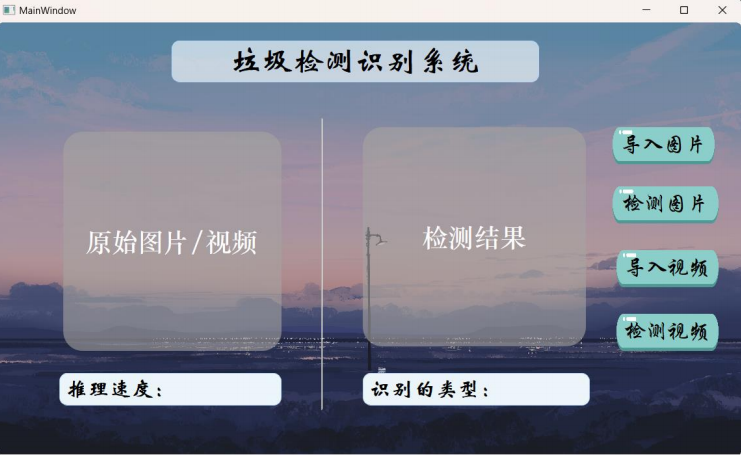

<div align="center">
  <a href="./README.md">English</a> | 
  <a href="./README.zh-CN.md">简体中文</a>
</div>
# Smart Waste Classification System 🚮➡️♻️



**An AI-powered Recycling Solution with YOLOv5 and PyTorch**  
`v2.1 | Academic Project | 2024`

[](https://github.com/shangguanwt/SmartWaste-Classifier/releases)
[](https://pytorch.org)
[](https://opencv.org)

## 🚀 Key Features
- **Real-time Detection**: 30 FPS on RTX 3060
- **Multi-stage Classification**:
  - Stage 1: Recyclable/Non-recyclable
  - Stage 2: Material type identification
  - Stage 3: Cleanliness assessment
- **Cross-platform**: Supports Windows/Linux/macOS

## 🛠️ Installation
### Prerequisites
- Python 3.8+
- CUDA 11.3 (recommended)
- NVIDIA Driver ≥510.47.03

### Quick Start
```bash
# Clone repository
git clone https://github.com/shangguanwt/SmartWaste-Classifier.git
cd SmartWaste-Classifier

# Install dependencies
pip install -r requirements.txt

# Download pretrained models
wget https://your-cdn.com/models/recycle_yolov5s.pt -P models/
```

## 📊 Performance Benchmarks
| Model | mAP@0.5 | FPS | VRAM Usage |
|-------|---------|-----|------------|
| YOLOv5n | 84.1% | 58 | 1.1GB |
| YOLOv5s | 87.3% | 45 | 1.4GB |
| **Our Model** | **91.4%** | **38** | **3.8GB** |

## 🌐 Supported Categories
```python
# Defined in dataset.yaml
names: 
  0: plastic_bottle
  1: glass_bottle
  2: paper_box
  3: metal_can
  ...
```

## 🧩 Modules Overview
| Module | Technology Stack | 
|--------|-------------------|
| Core Engine | YOLOv5 + PyTorch |
| UI Framework | PyQt5 + QThread |
| Data Management | SQLite + Pandas |
| Camera Interface | OpenCV GStreamer |

