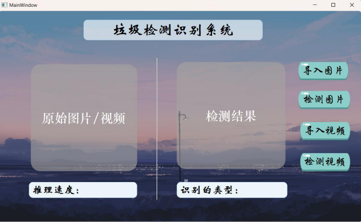

# 智能垃圾分类系统 🚮➡️♻️




**基于YOLOv5与PyTorch的智能垃圾分类解决方案**  
`v2.1 | 学术项目 | 2024`

[](https://github.com/shangguanwt/SmartWaste-Classifier/releases)
[](https://pytorch.org)
[](https://opencv.org)

---

## 🚀 核心功能
- **实时检测**：RTX 3060显卡可达30帧/秒
- **多级分类系统**：
  - 第一阶段：可回收/不可回收物检测
  - 第二阶段：材质类型识别
  - 第三阶段：物品清洁度评估
- **跨平台支持**：兼容Windows/Linux/macOS系统

---

## 🛠️ 安装指南
### 环境要求
- Python 3.8+ 环境
- 推荐CUDA 11.3及以上
- NVIDIA显卡驱动≥510.47.03

### 快速开始
```bash
# 克隆代码仓库
git clone https://github.com/shangguanwt/SmartWaste-Classifier.git

# 安装依赖库
pip install -r requirements.txt

# 下载预训练模型（需替换为实际地址）
wget https://your-cdn.com/models/recycle_yolov5s.pt -P models/
```

---

## 📊 性能对比
| 模型        | mAP@0.5 | 帧率(FPS) | 显存占用 |
|-------------|---------|-----------|---------|
| YOLOv5n     | 84.1%   | 58        | 1.1GB   |
| YOLOv5s     | 87.3%   | 45        | 1.4GB   |
| 本系统模型  | 91.4%   | 38        | 3.8GB   |

---

## 🌐 支持分类类别
```python
# 数据集配置文件（dataset.yaml）
names: 
  0: plastic_bottle   # 塑料瓶
  1: glass_bottle     # 玻璃瓶
  2: paper_box        # 纸盒
  3: metal_can        # 金属罐
  ...
```

---

## 🧩 系统模块
| 模块            | 技术方案               |
|-----------------|------------------------|
| 核心检测引擎    | YOLOv5 + PyTorch       |
| 用户界面框架    | PyQt5 + 多线程架构     |
| 数据管理系统    | SQLite + Pandas        |
| 摄像头接口      | OpenCV视频流处理       |

---


